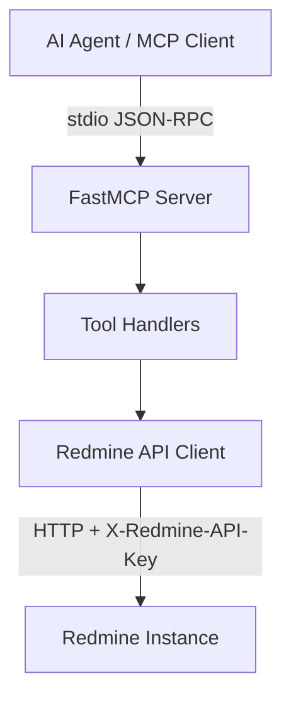
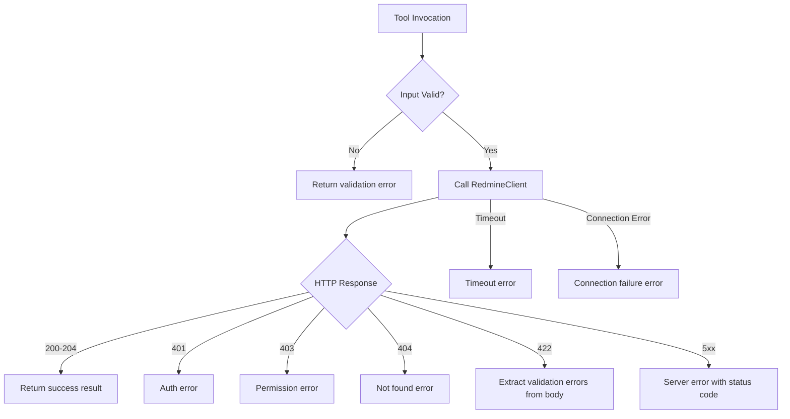

# Design Document: Redmine MCP Server

## Overview

This document describes the technical design for an MCP server that wraps the Redmine REST API. The server is implemented in Python using the FastMCP library and communicates over stdio transport. It exposes Issues, Projects, and Search operations as MCP tools that AI agents can invoke.

The design prioritizes minimalism — a thin wrapper layer that translates MCP tool invocations into Redmine REST API calls and returns structured results. There is no caching, no background processing, and no local state beyond the configured environment variables.

## Architecture

The server follows a simple layered architecture:



### Layers

1. **FastMCP Server Layer** — Handles MCP protocol, stdio transport, JSON-RPC message framing, tool registration, and response serialization. Provided by the FastMCP library.
2. **Tool Handlers** — Python functions decorated with `@mcp.tool()` that define parameter schemas, validate inputs, and orchestrate calls to the API client.
3. **Redmine API Client** — A single `RedmineClient` class that manages HTTP communication with the Redmine instance (authentication, request building, response parsing, error mapping).

### Key Design Decisions

| Decision | Rationale |
|----------|-----------|
| Single-file or minimal-module layout | Quick and minimal — this is a thin wrapper, not a framework |
| `httpx` for HTTP client | Async-capable, modern Python HTTP library with timeout support |
| Environment variables for config | Standard pattern for MCP servers, no config file needed |
| Raise exceptions for errors | FastMCP propagates exceptions to the client with `isError: true` |
| Return dicts/strings from tools | FastMCP handles serialization to MCP response format |

## Components and Interfaces

### 1. Entry Point (`server.py`)

```python
from fastmcp import FastMCP
import os

mcp = FastMCP("redmine-mcp-server")

# Configuration validated at import time
REDMINE_URL = os.environ.get("REDMINE_URL", "")
REDMINE_API_KEY = os.environ.get("REDMINE_API_KEY", "")
```

### 2. RedmineClient

A lightweight HTTP client that handles all communication with the Redmine REST API.

```python
class RedmineClient:
    def __init__(self, base_url: str, api_key: str):
        """Initialize with Redmine URL and API key."""
    
    async def get(self, path: str, params: dict = None) -> dict:
        """GET request to Redmine API."""
    
    async def post(self, path: str, data: dict) -> dict:
        """POST request to Redmine API."""
    
    async def put(self, path: str, data: dict) -> None:
        """PUT request to Redmine API."""
    
    async def delete(self, path: str) -> None:
        """DELETE request to Redmine API."""
```

**Responsibilities:**
- Set `X-Redmine-API-Key` header on all requests
- Set `Content-Type: application/json` header
- Enforce 30-second timeout on all requests
- Map HTTP error codes to descriptive error messages
- Parse JSON response bodies

### 3. Tool Handlers

Each tool is a decorated async function. Tools are grouped by domain:

**Issues Tools:**
| Tool Name | Redmine Endpoint | HTTP Method |
|-----------|-----------------|-------------|
| `list_issues` | `/issues.json` | GET |
| `get_issue` | `/issues/{id}.json` | GET |
| `create_issue` | `/issues.json` | POST |
| `update_issue` | `/issues/{id}.json` | PUT |
| `delete_issue` | `/issues/{id}.json` | DELETE |
| `add_watcher` | `/issues/{id}/watchers.json` | POST |
| `remove_watcher` | `/issues/{id}/watchers/{user_id}.json` | DELETE |

**Projects Tools:**
| Tool Name | Redmine Endpoint | HTTP Method |
|-----------|-----------------|-------------|
| `list_projects` | `/projects.json` | GET |
| `get_project` | `/projects/{id}.json` | GET |
| `create_project` | `/projects.json` | POST |
| `update_project` | `/projects/{id}.json` | PUT |
| `delete_project` | `/projects/{id}.json` | DELETE |
| `archive_project` | `/projects/{id}/archive.json` | PUT |
| `unarchive_project` | `/projects/{id}/unarchive.json` | PUT |

**Search Tools:**
| Tool Name | Redmine Endpoint | HTTP Method |
|-----------|-----------------|-------------|
| `search` | `/search.json` | GET |

### 4. Input Validation

Validation happens in two places:
- **Tool-level**: Required parameters, type checks, value constraints (e.g., positive integer IDs, limit caps)
- **Redmine-level**: Domain validation errors returned by the Redmine API (e.g., duplicate identifiers, invalid references)

Tool-level validation raises a `ValueError` (or returns an error dict) before making any HTTP request. Redmine-level validation errors are extracted from 422 responses and returned to the agent.

### 5. Error Handling Flow



## Data Models

The server does not define its own data models or ORM layer. It passes through Redmine's JSON structures with minimal transformation. Key data shapes returned by tools:

### Issue (list item)
```json
{
  "id": 123,
  "project": {"id": 1, "name": "Project Name"},
  "tracker": {"id": 1, "name": "Bug"},
  "status": {"id": 1, "name": "New"},
  "priority": {"id": 2, "name": "Normal"},
  "subject": "Issue title",
  "updated_on": "2024-01-15T10:30:00Z"
}
```

### Issue (detail)
```json
{
  "id": 123,
  "project": {"id": 1, "name": "Project Name"},
  "tracker": {"id": 1, "name": "Bug"},
  "status": {"id": 1, "name": "New"},
  "priority": {"id": 2, "name": "Normal"},
  "author": {"id": 1, "name": "Admin"},
  "subject": "Issue title",
  "description": "Full description",
  "start_date": "2024-01-15",
  "due_date": null,
  "done_ratio": 0,
  "estimated_hours": null,
  "spent_hours": 0.0,
  "created_on": "2024-01-15T10:30:00Z",
  "updated_on": "2024-01-15T10:30:00Z",
  "closed_on": null
}
```

### Project (detail)
```json
{
  "id": 1,
  "name": "Project Name",
  "identifier": "project-name",
  "description": "Project description",
  "homepage": "",
  "status": 1,
  "is_public": true,
  "created_on": "2024-01-01T00:00:00Z",
  "updated_on": "2024-01-15T10:30:00Z"
}
```

### Search Result
```json
{
  "id": 45,
  "title": "Result title",
  "type": "issue",
  "url": "/issues/45",
  "description": "Excerpt of matching content",
  "datetime": "2024-01-15T10:30:00Z"
}
```

### Paginated Response Envelope
```json
{
  "total_count": 150,
  "offset": 0,
  "limit": 25,
  "issues": [...]
}
```

### Error Response
```json
{
  "error": "Issue not found",
  "status_code": 404,
  "details": []
}
```

### Validation Error Response (from Redmine 422)
```json
{
  "error": "Validation failed",
  "status_code": 422,
  "details": ["Subject cannot be blank", "Project is not valid"]
}
```


## Correctness Properties

*A property is a characteristic or behavior that should hold true across all valid executions of a system — essentially, a formal statement about what the system should do. Properties serve as the bridge between human-readable specifications and machine-verifiable correctness guarantees.*

### Property 1: URL Validation Rejects Invalid Schemes

*For any* string that does not start with "http://" or "https://", the URL validation logic SHALL reject it with an error indicating the format is invalid. Conversely, *for any* string that starts with "http://" or "https://", validation SHALL accept it.

**Validates: Requirements 1.5**

### Property 2: API Key Header Always Present

*For any* configured API key value and any HTTP request made by the RedmineClient, the outgoing request SHALL include the `X-Redmine-API-Key` header with the exact configured API key value.

**Validates: Requirements 1.6**

### Property 3: Query Parameters Passed Through

*For any* valid filter parameter (project_id, status_id, assigned_to_id, tracker_id, sort column/direction, scope, resource types), the corresponding query parameter SHALL appear in the outgoing HTTP request to Redmine with the provided value.

**Validates: Requirements 2.2, 2.3, 2.4, 2.5, 2.6, 14.2, 14.3**

### Property 4: Pagination Limit Capped at 100

*For any* limit value provided by the agent, the effective limit sent to the Redmine API SHALL be `min(limit, 100)`. The offset SHALL pass through unchanged for any non-negative value.

**Validates: Requirements 2.7, 8.2, 14.5**

### Property 5: Paginated Responses Include Metadata

*For any* paginated response from the Redmine API that contains `total_count`, `offset`, and `limit` fields, the tool's return value SHALL include all three fields.

**Validates: Requirements 2.8, 8.4, 14.7**

### Property 6: Response Payloads Contain Required Fields

*For any* valid Redmine response: issue list items SHALL contain id, project, tracker, status, priority, subject, and updated_on; issue details SHALL contain all detail-level fields; project details SHALL contain id, name, identifier, description, homepage, status, is_public, created_on, and updated_on; search results SHALL contain id, title, type, url, description, and datetime.

**Validates: Requirements 2.9, 3.1, 9.1, 14.6**

### Property 7: Non-Positive-Integer IDs Rejected

*For any* value that is not a positive integer (zero, negative numbers, floats, strings), the tool SHALL return a validation error before making any HTTP request.

**Validates: Requirements 3.4, 6.4**

### Property 8: Unsupported Include Values Rejected

*For any* include parameter value that is not in the tool's supported set, the tool SHALL return a validation error listing the supported values. This applies to both issue includes (children, attachments, relations, changesets, journals, watchers, allowed_statuses) and project includes (trackers, issue_categories, enabled_modules, time_entry_activities, issue_custom_fields).

**Validates: Requirements 3.5, 9.4**

### Property 9: Optional Fields Included in Request Body

*For any* subset of optional fields provided with valid values when creating or updating an issue or project, all provided fields SHALL appear in the outgoing HTTP request body.

**Validates: Requirements 4.2, 5.1, 5.2, 10.2, 11.1**

### Property 10: Redmine Validation Errors Extracted

*For any* HTTP 422 response from Redmine containing an `errors` array, the tool SHALL extract every error message from that array and return them as a structured list in the error response.

**Validates: Requirements 4.5, 5.5, 10.5, 11.4, 15.4**

### Property 11: Delete Confirmations Include Identifier

*For any* successful delete operation (issue or project), the confirmation response SHALL include the identifier (issue ID or project identifier) of the deleted resource.

**Validates: Requirements 6.2, 12.2**

### Property 12: All Error Responses Include HTTP Status Code

*For any* HTTP error response from the Redmine instance (4xx or 5xx), the tool's error response SHALL include the HTTP status code.

**Validates: Requirements 15.7, 15.8**

### Property 13: Tool Naming Convention

*For every* registered MCP tool, the tool name SHALL match the pattern `[a-z][a-z0-9_]*` (snake_case) and the docstring SHALL be at most 200 characters in length.

**Validates: Requirements 16.5**

## Error Handling

### Error Categories

| HTTP Status | Error Type | User-Facing Message Pattern |
|-------------|-----------|---------------------------|
| 401 | Authentication | "Authentication failed: invalid or expired API key" |
| 403 | Permission | "Permission denied: insufficient privileges for this operation" |
| 404 | Not Found | "{resource_type} not found" |
| 422 | Validation | "Validation failed: [list of errors]" |
| 5xx | Server Error | "Redmine server error (HTTP {code}): {body}" |
| Connection Error | Network | "Connection failed: unable to reach {url}" |
| Timeout | Timeout | "Request timed out after 30 seconds" |

### Error Response Structure

All errors returned to the MCP client follow this structure:

```python
{
    "error": "Human-readable error summary",
    "status_code": 404,       # HTTP status code (when applicable)
    "details": [...]           # Array of specific error messages (for 422)
}
```

### Implementation Strategy

- Use a single `_handle_response` method in `RedmineClient` that checks status codes and raises typed exceptions
- Custom exception classes: `RedmineAuthError`, `RedminePermissionError`, `RedmineNotFoundError`, `RedmineValidationError`, `RedmineConnectionError`, `RedmineTimeoutError`
- Tool handlers catch these exceptions and format appropriate error responses
- FastMCP propagates errors with `isError: true` flag to the client

### Timeout Configuration

- HTTP connect timeout: 10 seconds
- HTTP read timeout: 30 seconds (per Requirement 15.6)
- No retry logic — errors are returned immediately to the agent

## Testing Strategy

### Test Framework

- **pytest** with `pytest-asyncio` for async tool tests
- **httpx** mocking via `respx` or `pytest-httpx` for HTTP request/response mocking
- **hypothesis** for property-based testing

### Unit Tests (Example-Based)

Unit tests cover specific scenarios and edge cases:

- Configuration: missing env vars, empty env vars, valid config
- Default pagination: verify offset=0, limit=25 when no params provided
- Required field validation: missing project_id, missing subject, empty identifier
- HTTP error mapping: 401 → auth error, 403 → permission, 404 → not found
- Connection errors: timeout, unreachable host
- Watcher operations: add/remove with correct paths
- Archive/unarchive: correct PUT paths

### Property-Based Tests (Hypothesis)

Property tests validate universal behaviors across generated inputs using the `hypothesis` library. Each test runs a minimum of 100 iterations.

| Property | Generator Strategy |
|----------|-------------------|
| P1: URL validation | Generate strings with/without http(s):// prefix |
| P2: API key header | Generate arbitrary strings as API keys |
| P3: Query params | Generate dicts of valid filter param combinations |
| P4: Limit cap | Generate integers for limit (0 to 10000) |
| P5: Pagination metadata | Generate dicts with total_count/offset/limit fields |
| P6: Required fields | Generate Redmine-like JSON with required fields |
| P7: ID validation | Generate non-positive integers, floats, strings |
| P8: Include validation | Generate random strings, subsets of invalid values |
| P9: Optional fields | Generate subsets of optional field dicts |
| P10: Error extraction | Generate lists of random error message strings |
| P11: Delete confirmation | Generate positive integers and identifier strings |
| P12: Status code in errors | Generate 4xx/5xx status codes |
| P13: Tool naming | Introspect registered tools, check regex and length |

Each property test is tagged with:
```python
# Feature: redmine-mcp-server, Property {N}: {property text}
```

### Test Organization

```
tests/
├── test_config.py          # Server configuration tests
├── test_client.py          # RedmineClient HTTP behavior
├── test_issues.py          # Issue tool handlers
├── test_projects.py        # Project tool handlers
├── test_search.py          # Search tool handler
├── test_errors.py          # Error handling and mapping
└── test_properties.py      # All property-based tests (hypothesis)
```

### What is NOT Tested

- Actual Redmine API behavior (that's Redmine's responsibility)
- FastMCP protocol serialization internals
- Network-level behavior beyond timeout/connection errors
